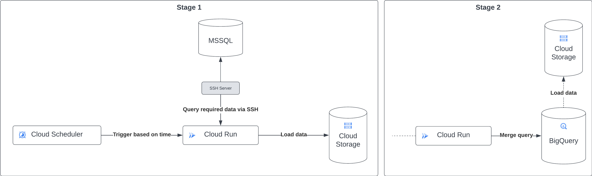

# Data Pipeline Documentation

## Introduction

This document outlines the steps and components involved in the data pipeline that transfers data from an MSSQL Server to Google BigQuery for table replication.

## Overview

The pipeline automates the process of extracting data from MSSQL, transferring it into Google Cloud Storage (GCS), and loading it into BigQuery. The orchestration of these tasks is managed by [Google Cloud Scheduler](https://cloud.google.com/scheduler) and executed within a Cloud Run instance hosting a Fast API application.

## Architecture and Component Details

### System Architecture

The attached diagrams illustrate the high-level architecture of the pipeline across two stages:



### Component Roles

-   **MSSQL Server**: The source database system containing the original data sets.
-   **SSH Server**: Provides secure access to the MSSQL Server for data extraction.
-   **Google Cloud Scheduler**: Triggers the Cloud Run service at specified intervals.
-   **Cloud Run**: Hosts the Fast API application, manages SSH connections, data extraction, and loading processes.
-   **Cloud Storage**: Serves as an intermediary storage for CSV data before it's loaded into BigQuery.
-   **BigQuery**: The data warehousing solution where the data is finally stored and queried.

## Data Flow and Processing

The data pipeline operates in two primary stages:

### Stage 1: Data Extraction and Transfer

1. **Trigger**: Cloud Scheduler initiates the Cloud Run function based on time.
2. **SSH Connection**: Cloud Run establishes an SSH connection to the MSSQL Server.
3. **Data Querying**: Specific data for a given time period is queried from the MSSQL table.
4. **Data Storage**: The queried data is saved locally and then uploaded to Cloud Storage as a CSV file.

### Stage 2: Data Loading and Merging

1. **Data Loading**: The CSV file from GCS is loaded into a temporary BigQuery table using the `load_table_from_uri` function.
2. **Data Merging**: A merge query updates the actual table in BigQuery with the new data from the temporary table.

## Scheduling, Execution, and Replication

### Cloud Scheduler and API Container

The Cloud Scheduler is configured to trigger the Cloud Run service with a POST request at a specified time interval. The input data is in the following format:

```json
{
    "source_table": "dbo.test_table",
    "date_filter_column": "date_column",
    "mode": "normal",
    "destination_table": "dbo.test_table",
    "start_date": "2021-01-01",
    "end_date": "2021-01-31",
    "gcs_bucket": "test_bucket",
    "gcs_path": "test_path",
    "file_name": "test_file",
    "date_columns": ["date_column"],
    "timestamp_columns": ["timestamp_column"]
}
```

Parameters

-   `source_table`: _(Required)_ The name of the table in MSSQL from which data is to be extracted. There is no default value; it must be provided in the request.
-   `date_filter_col`: _(Optional)_ The column used to filter data by dates. If not provided, and if the mode is set to "historical", the data extraction will not use a date filter, implying the default behavior is to extract all data without filtering.
-   `mode`: _(Optional)_ Determines the type of data extraction: "normal" for incremental loads or "historical" for full loads. The default value is "normal".
-   `dest_table`: _(Optional)_ The destination table in BigQuery where data will be loaded. The default value is the same as `source_table`.
-   `start_date`: _(Optional)_ The start of the date range for filtering data. If not provided, the default is set to yesterday's date. Must be in the format `YYYY-MM-DD`.
-   `end_date`: _(Optional)_ The end of the date range for filtering data. If not provided, the default is set to today's date. Must be in the format `YYYY-MM-DD`.
-   `gcs_bucket`: _(Optional)_ The Google Cloud Storage bucket for storing CSV files. The default value is taken from the `GCS_BUCKET` environment variable.
-   `gcs_path`: _(Optional)_ The path in the GCS bucket where CSV files are stored. The default value is set to the `source_table` name.
-   `file_name`: _(Optional)_ The filename for the CSV file. If not provided, it is generated based on the `source_table`, `start_date`, and `end_date` for normal mode or appended with "historical" for historical mode.
-   `date_cols`: _(Optional)_ A list of column names with date data to be formatted. The default is an empty list, indicating no columns need date formatting unless specified.
-   `timestamp_cols`: _(Optional)_ A list of column names with timestamp data to be formatted. The default is an empty list, implying no timestamp formatting unless columns are explicitly provided.

Each table has a corresponding Cloud Scheduler job set to run daily, ensuring regular updates to the BigQuery dataset.

## Guide

### How to Add a New Table

To add a new table to the pipeline, follow these steps:

1. Create 2 sql scripts in the `sql` folder:

    - `<Table Name>_create.sql`: Contains the SQL query to create the table in BigQuery. Use the following template to create the script. Add the appropriate column names and data types for the table.
        ```SQL
        -- Create temp table SQL script
        CREATE OR REPLACE TABLE {bq_project}.{bq_dataset}.{table_name} (
            RowNum INT64,
            Item_ STRING,
            Description STRING,
            ...
        );
        ```
    - `<Table Name>_merge.sql`: Contains the SQL query to merge the data from the temporary table into the actual table in BigQuery. Use the following template to create the script. Add the appropriate column names for the table.

        ```SQL
        -- Merge table SQL script
        -- Create main table if not exists
        CREATE TABLE IF NOT EXISTS {bq_project}.{bq_dataset}.{table_name} (
            RowNum INT64,
            Item_ STRING,
            Description STRING,
            DateReceived TIMESTAMP,
            QtyReceived INT64,
            AmountOfPurchaseStillInStock INT64,
            RemainingLeftToAssignToAPurchase INT64,
            AgeOfInventoryInDays INT64,
            CurrentInventory INT64,
            ItemPrice FLOAT64,
            Buyer STRING,
            supplierName STRING,
            Category STRING,
            Idwarehouse INT64,
            LTM INT64,
            CubicFt FLOAT64
        );

        -- Merge data from temp table into main table
        MERGE {bq_project}.{bq_dataset}.{table_name} AS t
        USING {bq_project}.{bq_dataset}.{temp_table_name} AS s
        ON t.RowNum = s.RowNum
        WHEN MATCHED THEN
            UPDATE SET
                t.Item = s.Item,
                t.Description = s.Description,
                ...
        WHEN NOT MATCHED THEN
            INSERT (RowNum, Item, Description, ...)
            VALUES (s.RowNum, s.Item, s.Description, ...);
        ```

2. Build the Docker image and push it to Google Container Registry. Use the following commands:

    ```bash
    # Authenticate with Google Cloud
    gcloud auth activate-service-account mssql-to-bigquery@soundarounddatondw.iam.gserviceaccount.com --key-file=<SERVICE_ACCOUNT_FILE>

    # Configure Docker to use Google Container Registry
    gcloud auth configure-docker us-east1-docker.pkg.dev

    # Build the Docker image
    docker build --platform linux/amd64 -t us-east1-docker.pkg.dev/soundarounddatondw/dockerrepo/msssql-to-bq-fastpi .

    # Push the Docker image to Google Container Registry
    docker push us-east1-docker.pkg.dev/soundarounddatondw/dockerrepo/msssql-to-bq-fastpi
    ```

3. Create a new Cloud Scheduler job to trigger the Cloud Run service. Use these settings:
    - **Name**: `mssql-to-bq-<Table Name>`
    - **Description**: `<Table Name> Data Pipeline`
    - **Frequency**: `0 0 * * *`
    - **Timezone**: `IST`
    - **Target Type**: `HTTP`
    - **URL**: `https://msssql-to-bq-fastpi-vytfvphpna-ue.a.run.app`
    - **HTTP Method**: `POST`
    - **Body**: `{"source_table": "Inventory", "date_filter_column": "LastUpdated"}`
        > Update the body with the appropriate values for the table.

---

### How to run historical data load

To run a historical data load, follow these steps:

1. Update the body of the Cloud Scheduler job to include the following parameters:
    - `mode`: `"historical"`
2. Force run the Cloud Scheduler job to trigger the Cloud Run service. This will initiate the historical data load process.

---

### How to change the schedule of the pipeline run

To change the schedule of the pipeline run, update `Frenquency` and `Timezone` parameters of the Cloud Scheduler.

## Tables Currently in the Pipeline

_As of 2023-11-22_

| S.No | Source Table                  | Destination Table             | Cloud Scheduler Job Name                  |
| ---- | ----------------------------- | ----------------------------- | ----------------------------------------- |
| 1    | ActualAgedInventoryV3         | ActualAgedInventoryV3         | mssql-to-bq-acutalagedinventoryv3         |
| 2    | admins                        | admins                        | mssql-to-bq-admins                        |
| 3    | categories                    | categories                    | mssql-to-bq-categories                    |
| 4    | Categories_products           | Categories_products           | mssql-to-bq-categories_products           |
| 5    | customers                     | customers                     | mssql-to-bq-customers                     |
| 6    | Inventory                     | Inventory                     | mssql-to-bq-inventory                     |
| 7    | OrderDetail                   | OrderDetail                   | mssql-to-bq-orderdetail                   |
| 8    | orders                        | orders                        | mssql-to-bq-orders                        |
| 9    | Products                      | Products                      | mssql-to-bq-products                      |
| 10   | suppliers                     | suppliers                     | mssql-to-bq-suppliers                     |
| 11   | tblAVLInventoryForProcurement | tblAVLInventoryForProcurement | mssql-to-bq-tblavlinventoryforprocurement |
| 12   | tblCUFTData                   | tblCUFTData                   | mssql-to-bq-tblcuftdata                   |
| 13   | tblfbaprocurementdata         | tblfbaprocurementdata         | mssql-to-bq-tblfbaprocurementdata         |
| 14   | VendorProducts                | VendorProducts                | mssql-to-bq-vendorproducts                |
| 15   | Warehouse                     | Warehouse                     | mssql-to-bq-warehouse                     |
